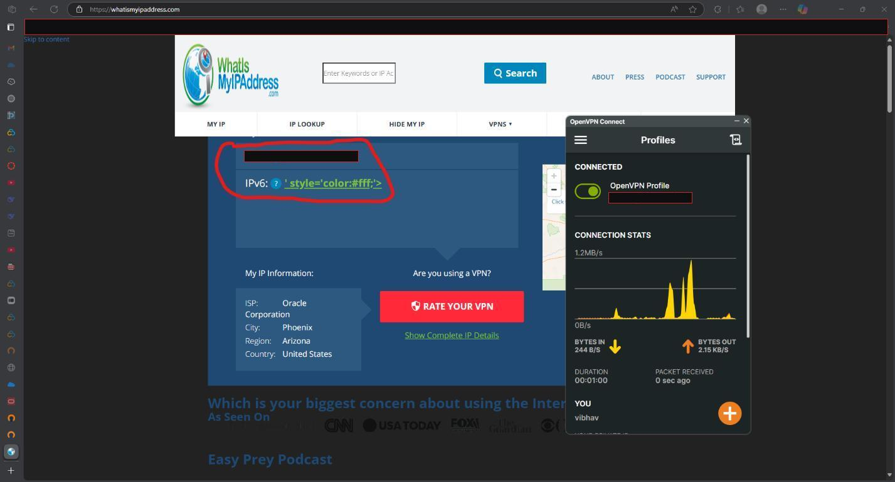
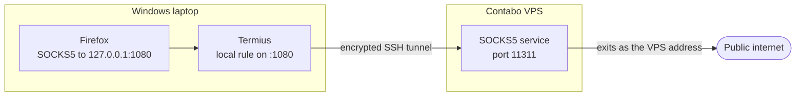
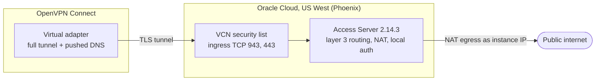

<h1 align="center">Build Your Own VPN</h1>

<p align="center">
  <em>Two lab builds that remove the third-party VPN provider: an SSH tunnel through a VPS, and a self-hosted OpenVPN Access Server on Oracle Cloud. Plus an optional, scripted way to repeat the build.</em>
</p>

<p align="center">
  
  
  
  
</p>

---

> **TL;DR:** This repo documents a school lab (CSCE 5552, Cyber Essentials, University of North Texas). **Part 1** forwards a local port through SSH to a rented VPS and points Firefox at it as a SOCKS5 proxy. **Part 2** builds an OpenVPN Access Server on Oracle Cloud with its own firewall rule, user, routing and DNS policy. Both were checked with a before and after public IP lookup. **Part 3** is an optional add-on that automates the same idea with Terraform and WireGuard. The lab write-ups describe what was done in the lab. Part 3 is new work and is labelled as such.

## What was built

| | **Part 1: SSH tunnel** | **Part 2: OpenVPN Access Server** |
|---|---|---|
| Server | Contabo VPS running Ubuntu | Oracle Cloud instance `openvpn-demo` (Access Server 2.14.3, BYOL image) |
| Client | Termius, Firefox | OpenVPN Connect on Windows |
| Traffic covered | Only the app pointed at the proxy | The whole device (full tunnel) |
| DNS | Firefox resolves locally unless remote DNS is turned on | Server pushes DNS `1.1.1.1` and `1.0.0.1` |
| Walkthrough | [Part 1](docs/part1-ssh-tunnel-port-forwarding.md) | [Part 2](docs/part2-openvpn-access-server.md) |

## Results

Each tunnel was checked the same way: look up the public IP, connect, look it up again. Addresses are blacked out in the screenshots, but the ISP and location the lookup site reports are still visible.

| | Before | After | Screenshots |
|---|---|---|---|
| Part 1 | Charter Communications, Denton, Texas | Contabo GmbH, Lauterbourg, France | [before](docs/images/part1/07-ip-before-tunnel.png), [after](docs/images/part1/08-ip-after-tunnel.jpg) |
| Part 2 | Charter Communications, Denton, Texas | Oracle Corporation, Phoenix, Arizona | [before](docs/images/part2/16-ip-before-vpn.jpg), [after](docs/images/part2/18-ip-after-vpn-success.jpg) |

<p align="center">
  
  <br><em>Part 2 connected: the lookup site reports Oracle Corporation in Phoenix.</em>
</p>

## How each one works

### Part 1: local port forward to a SOCKS5 service on the VPS

In Termius the forwarding rule listens on `127.0.0.1:1080` on the laptop and sends the traffic through SSH to the VPS, to a destination port of `11311`. Firefox uses `127.0.0.1:1080` as a SOCKS v5 proxy.



<!-- TODO(author): name the SOCKS daemon that listens on port 11311 on the VPS. The screenshots show the port but not the program. -->

The catch: only traffic sent to `127.0.0.1:1080` is protected. Other apps, and DNS lookups unless remote DNS is enabled, still use the home connection. Part 2 addresses that.

### Part 2: OpenVPN Access Server on Oracle Cloud



In the lab the only ingress rule added was TCP `943,443` from `0.0.0.0/0`, so the client connected over TCP 443. The server also listens on UDP 1194, but no rule opened it.

## Part 3: Automation

The lab steps were done by hand in web consoles. [Part 3](docs/part3-automation.md) shows how to repeat the idea as code: Terraform creates the Oracle network and instance, cloud-init installs and locks down a WireGuard server, and small scripts add clients and prove the tunnel works. It is a separate, newer build and was tested locally, not against a live Oracle account. The page says exactly what was and was not tested.

```bash
make check                 # shellcheck, style, all tests, screenshot scan
cd automation/terraform && cp terraform.tfvars.example terraform.tfvars   # then edit
```

## Repository layout

```
.
├── README.md
├── docs/
│   ├── part1-ssh-tunnel-port-forwarding.md
│   ├── part2-openvpn-access-server.md
│   ├── part3-automation.md
│   └── images/part1 (8), part2 (18)
├── automation/
│   ├── terraform/              OCI network, instance, cloud-init module
│   ├── scripts/                new-client.sh, verify-vpn.sh
│   └── ssh-tunnel/             socks-tunnel.sh, ssh_config, systemd unit, Firefox prefs
├── tests/                      shell and Python tests
├── tools/                      screenshot_guard.py, check_style.py, check_links.py
├── Makefile
└── .github/workflows/ci.yml
```

## Things I would do if i forked this repositoru

- **Self-signed certificate.** The client showed `SELF_SIGNED_CERT_IN_CHAIN` and the warning was accepted. A real deployment needs a proper hostname and certificate.
- **Admin UI open to `0.0.0.0/0`.** The ingress rule exposes port 943, which includes the admin UI, to the whole internet. Restrict it to your own address.
- **Generated admin password.** The first-boot wizard printed an auto-generated password for the `openvpn` account. Change it and enable MFA, which is disabled by default.
- **RSA-2048 key.** It works, but ed25519 is a better default.
- **No kill switch.** If the tunnel drops, traffic falls back to the normal connection.

## A note on the screenshots

The screenshots come from the real vpn configuration. Server and home IP addresses, the auto-generated password, SSH public key text, Oracle resource IDs, the tenancy name, the browser address bar and bookmarks bar are blacked out. `tools/screenshot_guard.py` scans them with OCR and runs in CI, but OCR can miss things, so every image was also checked by eye. If you fork this, look at your own screenshots before publishing.

---

<p align="center"><sub>Built by <strong>Sri Vibhav Raju Chennamadhava</strong></sub></p>
