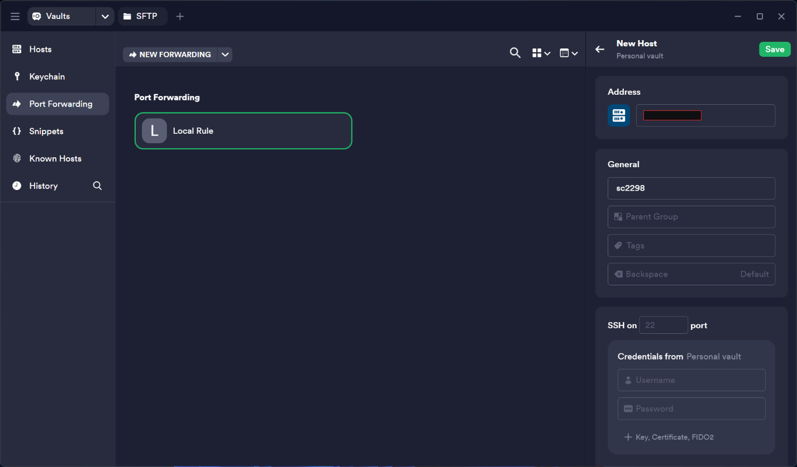
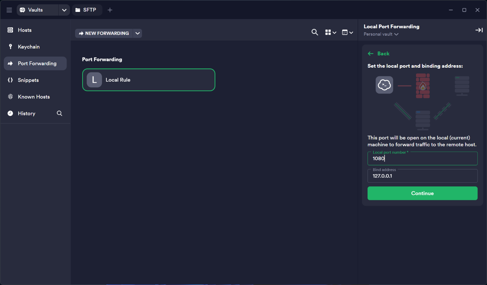
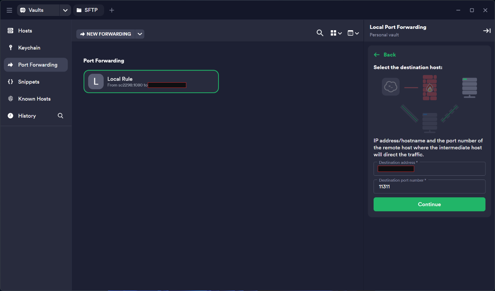
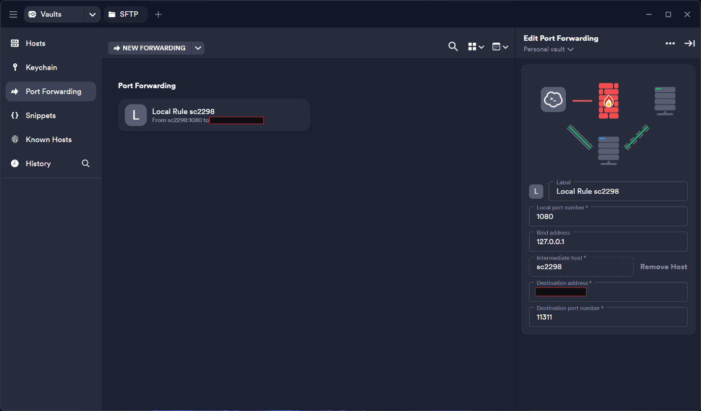
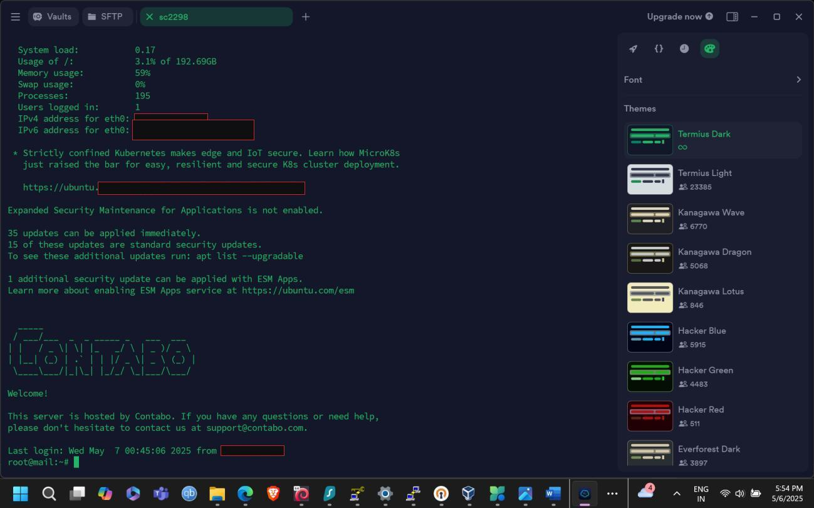
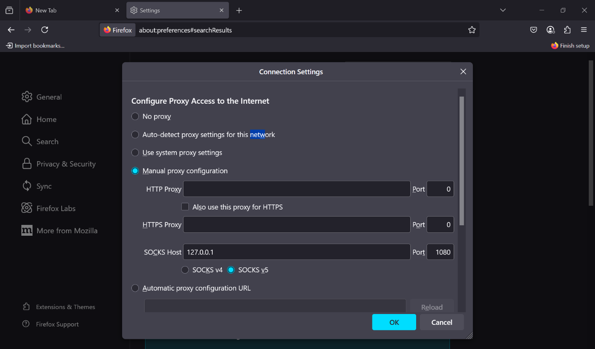
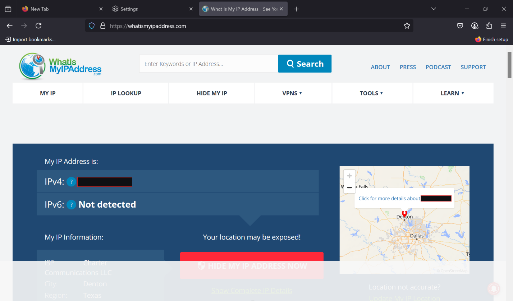
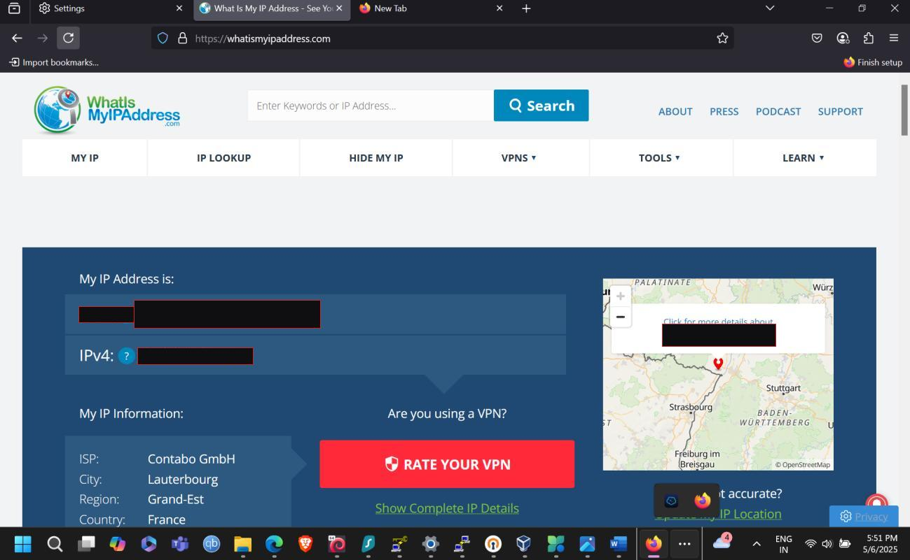

# Part 1: SSH Tunnel with Port Forwarding

> Sending a browser's traffic through an SSH connection to a VPS so that websites see the VPS address instead of the home address.

[Back to overview](../README.md) | [Part 2: Self-hosted OpenVPN](part2-openvpn-access-server.md) | [Part 3: Automation](part3-automation.md)

---

## The idea in one paragraph

SSH authenticates both ends, encrypts the channel, and can carry extra TCP connections alongside a login session. Port forwarding exposes that as a port on your own machine. Point a browser at that port as a SOCKS5 proxy and its requests travel through the encrypted SSH channel and leave from the remote server's address.

**Prerequisites:** a Linux VPS with SSH access, an SSH client (Termius here), and a browser (Firefox here).

## Background

| Term | Meaning |
|---|---|
| **SSH (Secure Shell)** | A cryptographic protocol for operating network services securely over an untrusted network. |
| **VPN (Virtual Private Network)** | Extends a private network across a public one so a device behaves as if it were attached to the private network directly. |
| **Port forwarding** | Redirects a connection from one address and port to another as it passes through a gateway. Local forwarding maps a local port to a fixed destination. Dynamic forwarding turns the local port into a SOCKS proxy that picks the destination per request. |

### Where common VPN protocols sit

| Protocol | Transport | Notes |
|---|---|---|
| **OpenVPN** | TLS over TCP or UDP | Open source and configurable. Used in Part 2. |
| **IPSec** | Network layer | Common for site-to-site tunnels. |
| **WireGuard** | UDP | Much smaller codebase. Used in Part 3. |
| **L2TP/IPSec** | L2TP wrapped in IPSec | L2TP has no encryption of its own. |
| **PPTP** | Legacy | Cryptographically broken. Avoid. |

---

## Step 1: Register the VPS as a host

The VPS is a Contabo server running Ubuntu. In Termius it gets a host entry with its public address and a label. The SSH port field was left at its default of 22.



## Step 2: Open the local end of the tunnel

Create a **Local** forwarding rule and bind it to `127.0.0.1:1080`.

- **Port 1080** is the conventional SOCKS port. Nothing enforces it, but tools expect it.
- **Bind address `127.0.0.1`, not `0.0.0.0`.** Only this machine can use the proxy. Binding to every interface would let anyone on the same network use your tunnel.



## Step 3: Point the rule at the remote end

The rule's intermediate host is the VPS. The destination address is the VPS address and the destination port is `11311`.



The finished rule reads: local `127.0.0.1:1080`, through the VPS, to port `11311`.



<!-- TODO(author): name the program that listens on port 11311 on the VPS and how it was installed. A local forward only relays bytes, so a SOCKS5 service has to be listening there for Firefox's SOCKS v5 setting to work. -->

## Step 4: Bring the tunnel up

Connecting to the VPS starts the session that carries the forwarded port. The login banner shows the server's addresses, which are the addresses the outside world sees instead of yours.



<details>
<summary><strong>OpenSSH equivalents (no GUI needed)</strong></summary>

<br>

The same local forward as in Termius:

```bash
# 127.0.0.1:1080 is relayed to port 11311 on the VPS
ssh -N -L 127.0.0.1:1080:127.0.0.1:11311 -p 22 <user>@<vps-address>
```

OpenSSH can also be the SOCKS proxy itself with dynamic forwarding. This needs no extra software on the server, and it is what the [automation helper](part3-automation.md#ssh-socks-helper) uses:

```bash
ssh -N -D 127.0.0.1:1080 -p 22 <user>@<vps-address>
```

`-N` holds the tunnel open without a remote command. Add `-f` to background it after login.

</details>

## Step 5: Route the browser through it

Firefox has its own proxy settings, separate from the operating system. Under **Settings, Network Settings, Manual proxy configuration**, set SOCKS Host `127.0.0.1`, Port `1080`, and choose **SOCKS v5**.



> **DNS leak warning.** Firefox resolves hostnames locally unless told otherwise, so your ISP still sees the domains you visit. Set `network.proxy.socks_remote_dns` to `true` in `about:config`, or tick "Proxy DNS when using SOCKS v5" in the same dialog. The screenshot above was taken before that step.

---

## Verification

**Before:** the lookup site reports the home connection, Charter Communications in Denton, Texas, with no IPv6.



**After:** the same page now reports Contabo GmbH in Lauterbourg, France. An IPv6 address shows up too, because the VPS has one.



| | Before | After |
|---|---|---|
| **ISP** | Charter Communications | Contabo GmbH |
| **Location** | Denton, Texas, US | Lauterbourg, Grand-Est, France |
| **IPv6** | Not detected | Present |

---

## What this approach does and does not protect

**Protects:** traffic from apps configured to use the proxy. The ISP sees one encrypted SSH session and not its contents.

**Does not protect:**

- Any other app on the machine, which keeps using the normal connection.
- DNS lookups, unless remote DNS is enabled.
- Anything you send unencrypted past the VPS. The VPS operator can see that traffic the way your ISP could. Trust moves to a host you chose.

If the SSH session drops, the proxied browser simply fails to connect, which is fail-closed for that app only.

For the whole device, including DNS, you need a network-layer VPN. That is [Part 2](part2-openvpn-access-server.md).
