# Part 2: Self-Hosted OpenVPN Access Server on Oracle Cloud

> A VPN server with its own certificate authority, firewall rule, user account and full-tunnel routing, running on an Oracle Cloud instance.

[Back to overview](../README.md) | [Part 1: SSH tunnel](part1-ssh-tunnel-port-forwarding.md) | [Part 3: Automation](part3-automation.md)

---

## What is different from Part 1

The SSH tunnel protected one browser. This protects the whole machine. The client gets a virtual network adapter and the operating system routes every app, plus DNS, through the server. The trade-off is that you now run a real service: certificates, firewall rules, users and routing policy are yours to get right.

**Prerequisites:** an Oracle Cloud account, PuTTY and PuTTYgen (or OpenSSH), and the OpenVPN Connect client. The account in the lab showed a "Free Tier account, currently in a Free Trial" banner. Check Oracle's current pricing for what your shape and image cost.

## Architecture

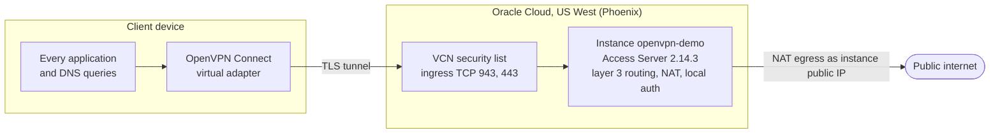

---

## Step 1: Launch the marketplace image

Oracle's marketplace carries an **OpenVPN Access Server BYOL** image (version 2.14.3 in the lab), so nothing is installed by hand. The listing says two connections are free, and the software price shows `$0.00/hr` per OCPU with additional fees for the infrastructure used.

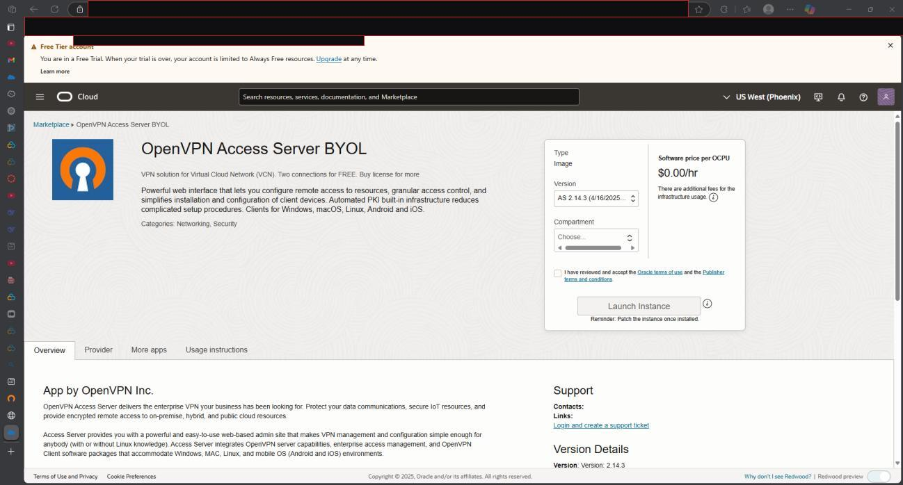

## Step 2: Place it on a network

The instance needs a VNIC in a Virtual Cloud Network. The form notes that a public IP address is required for the instance to be reachable from the internet. The lab selected an existing VCN and subnet.

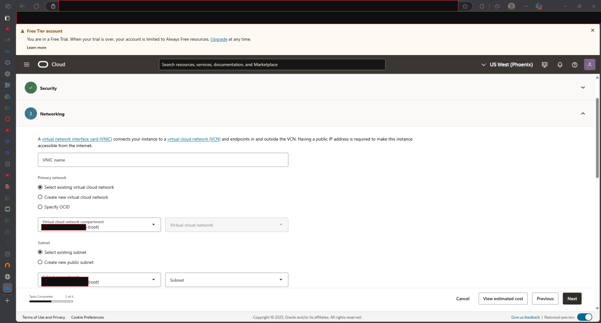

## Step 3: Generate an SSH key pair

The image uses key-based SSH login. PuTTYgen generated an RSA 2048-bit pair, with mouse movement as the entropy source.

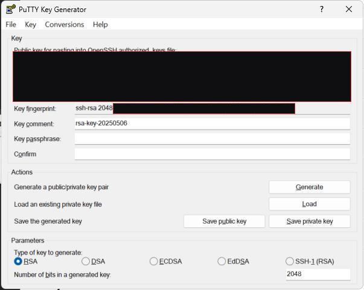

> **Treat the two halves differently.** The public key can be pasted anywhere. The private key never leaves your machine, and it cannot be regenerated from the public half, so save it before closing the window. `ed25519` would be a better algorithm choice than RSA-2048.

The public key is pasted into the "Add SSH keys" section of the create-instance form.

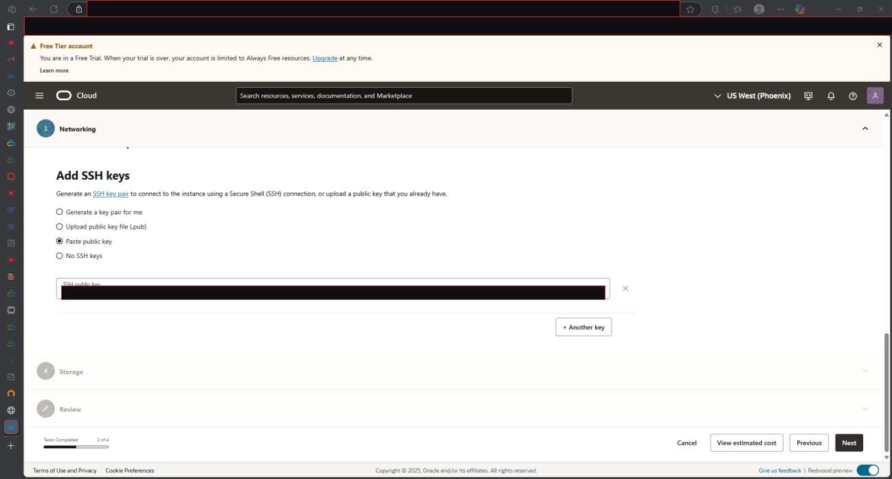

## Step 4: Provision

Oracle tracks the build as a work request, so each stage can be watched.

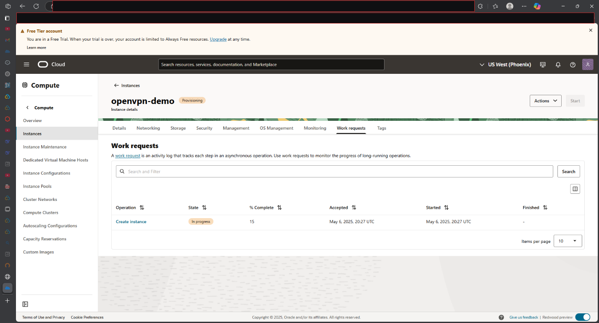

When the instance shows **Running**, the details page lists its public IP address, which is used for everything that follows.

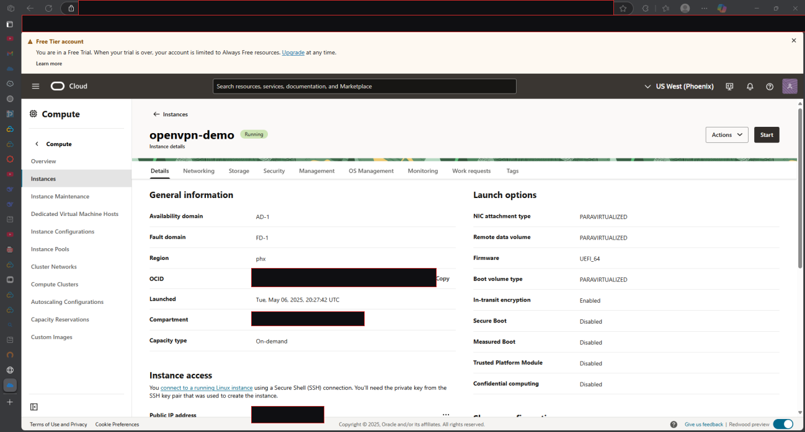

## Step 5: Open the firewall

Oracle blocks inbound traffic by default. In the lab one ingress rule was added to the VCN security list: TCP, source `0.0.0.0/0`, destination ports `943,443`, description `openvpn-demo`.

| Port | Protocol | Purpose | Opened in the lab? |
|---|---|---|---|
| **443** | TCP | VPN client connections. Also passes networks that only allow HTTPS. | Yes |
| **943** | TCP | Admin and client web interfaces | Yes |
| **1194** | UDP | Default OpenVPN data channel, usually faster than TCP | No, so the client used TCP 443 |

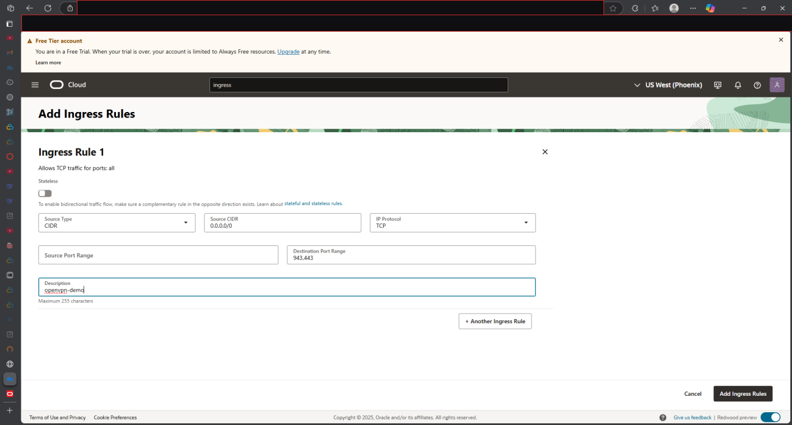

> **The source `0.0.0.0/0` is too open for port 943.** The VPN port has to be reachable by your clients, but the admin interface should be limited to your own address, or reached only once you are on the VPN.

## Step 6: Connect over SSH and run the first-boot wizard

PuTTY is pointed at the saved **private** key under *Connection, SSH, Auth, Credentials* and connects to the instance.

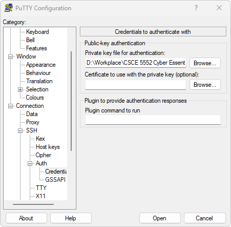

On first login the Access Server wizard runs. It asks whether to use the `openvpn` account for the Admin UI, offers to set a password (blank means a random one is generated), asks for an activation key (blank means later), initialises the server and web certificates, and prints the admin URLs. The lab left the password blank, so a random one was generated and printed.

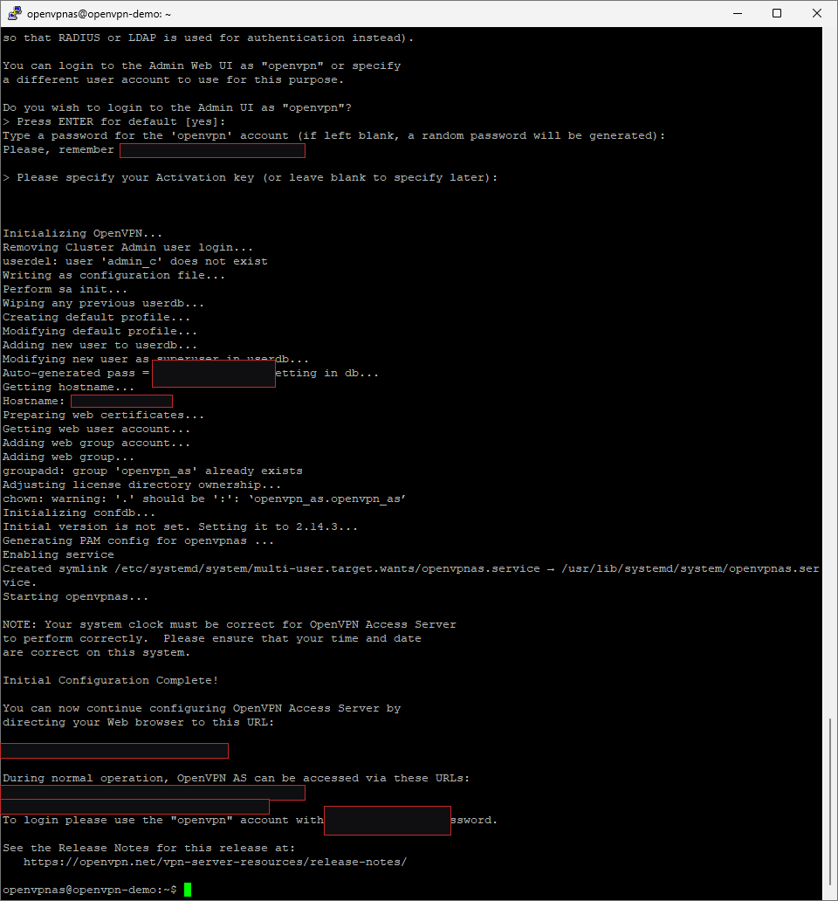

> **The generated password is printed in plain text in the terminal and its scrollback.** Change it after the first login. It is blacked out in the screenshot above.

The wizard prints two kinds of address: the admin UI at `https://<instance-ip>:943/admin` and the client UI at `https://<instance-ip>:943/`.

## Step 7: Tour the admin console

The Activation page shows the licence state: **2 VPN connections allowed**.

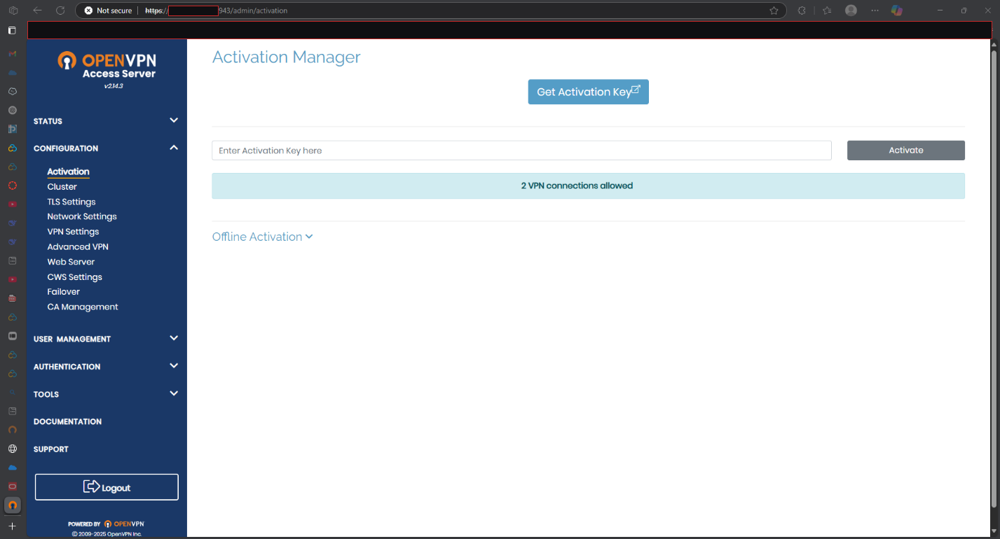

The Status Overview confirms the running configuration.

| Setting | Value |
|---|---|
| Access Server version | 2.14.3 |
| Allowed VPN connections | 2 |
| Authenticate users with | local |
| Accepting connections on | all interfaces |
| Port for VPN client connections | `tcp/443`, `udp/1194` |
| OSI layer | 3 (routing/NAT) |
| Clients access private subnets using | NAT |
| Node | openvpn-demo |

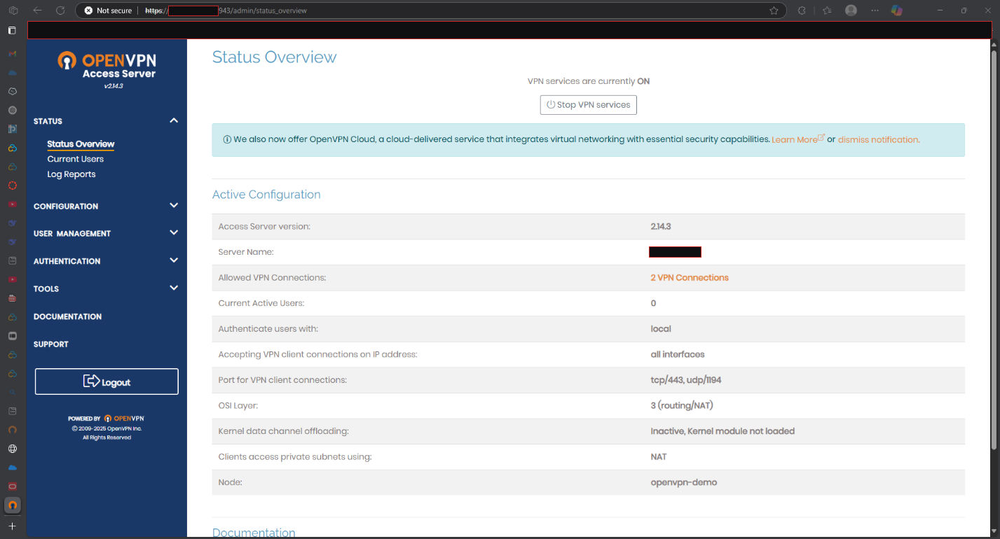

## Step 8: Set the routing and DNS policy

This step makes it a full-tunnel VPN.

- **Private subnets clients can reach:** `10.0.0.0/24`, reached using NAT.
- **Should client Internet traffic be routed through the VPN? Yes.** This is the full-tunnel switch. Without it, clients reach the private subnet but browse over their own connection.
- **Group default IP address network:** `172.27.240.0/20`, the pool dynamic client addresses come from.
- **Have clients use specific DNS servers? Yes,** with primary `1.1.1.1` and secondary `1.0.0.1`. Without this, clients may keep using their ISP's resolver even though the traffic is encrypted.

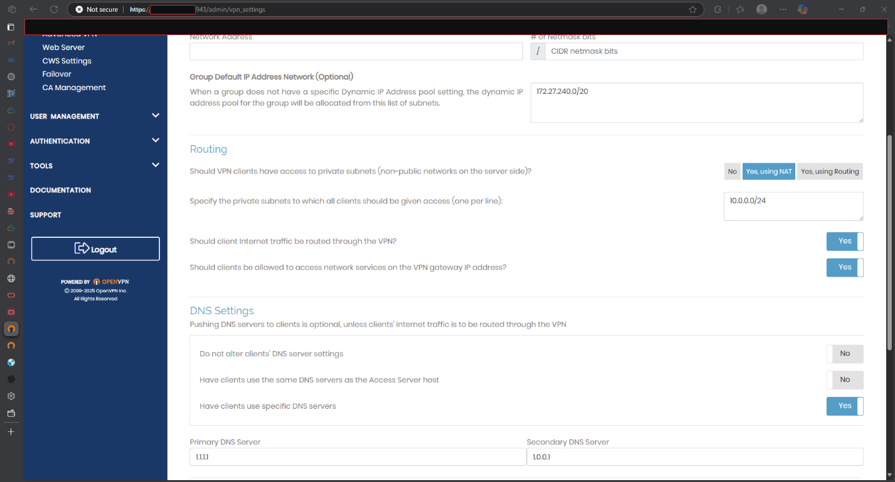

## Step 9: Create a VPN user

The admin account should not be the account you connect with. A separate user was created under **User Management, User Permissions**, using local authentication, dynamic IP addressing and NAT access control.

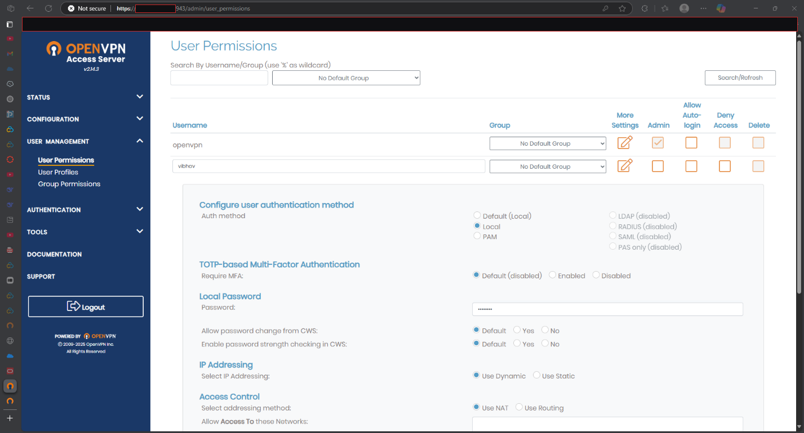

> **TOTP multi-factor authentication is available and defaults to disabled** (the screenshot shows "Default (disabled)"). For a server reachable from anywhere, turning it on is worth doing.

## Step 10: Install the client and connect

The OpenVPN Connect client comes from openvpn.net. It was installed on Windows and the server address was entered under **URL**.

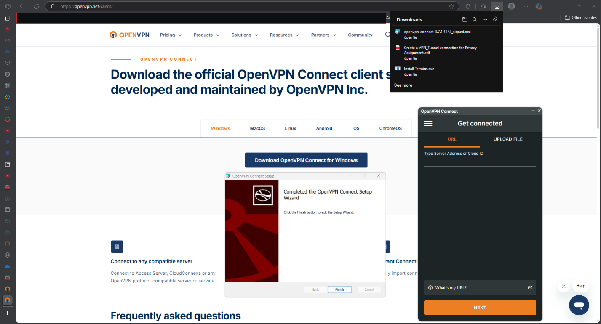

On first connection the client objects to the server's certificate.

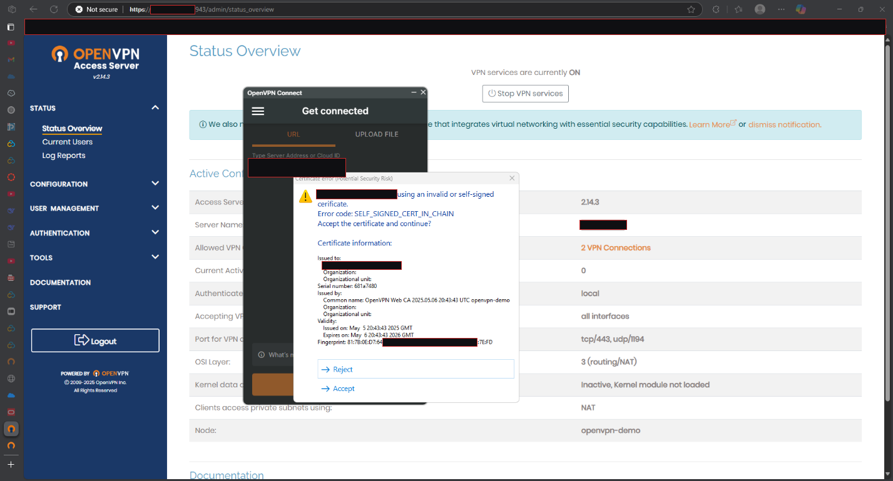

> **`SELF_SIGNED_CERT_IN_CHAIN` is expected.** The Access Server generated its own CA, which no client trusts by default. Accepting it once in a lab you control is reasonable, but a real deployment should use a proper hostname and certificate so that users are never trained to click through certificate warnings.

After accepting, the profile connects and the client shows live connection statistics.

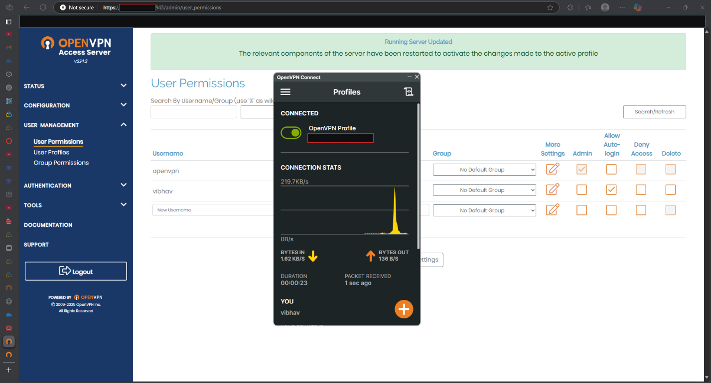

---

## Verification

**Before connecting:** the lookup site reports Charter Communications in Denton, Texas.

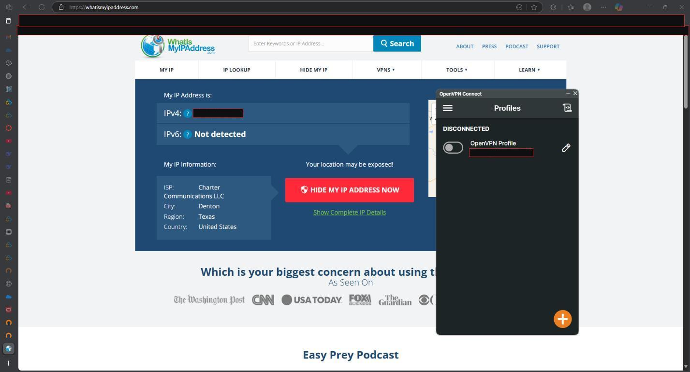

**After connecting:** the lookup reports Oracle Corporation in Phoenix, Arizona. The page rendered oddly in this capture (the circled area), but the ISP and location fields show the change.

| | Before | After |
|---|---|---|
| **ISP** | Charter Communications | Oracle Corporation |
| **Location** | Denton, Texas, US | Phoenix, Arizona, US |

---

## Takeaways

**What worked well.** The marketplace image turns PKI setup into a first-boot wizard, and the admin console shows the running configuration clearly.

**What the lab leaves imperfect.** The self-signed certificate, the admin port open to the internet, the generated admin password and the disabled MFA are all defaults a real deployment would change.

**Where it could go next.** [Part 3](part3-automation.md) rebuilds the same idea with WireGuard and Terraform so it can be repeated from code.
