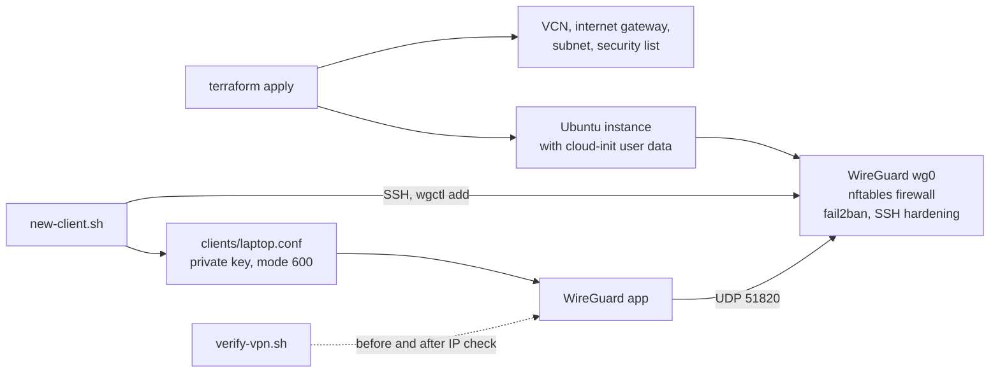

# Part 3: Automating the Build (optional)

> The same idea as Part 2, repeated from code: Terraform creates the Oracle Cloud network and instance, cloud-init sets up a WireGuard server, and small scripts add clients and prove the tunnel works.

[Back to overview](../README.md) | [Part 1](part1-ssh-tunnel-port-forwarding.md) | [Part 2](part2-openvpn-access-server.md)

---

## Read this first: what this is and is not

Parts 1 and 2 describe what was done in the lab, by hand. **This part is new work added afterwards.** It uses WireGuard rather than OpenVPN Access Server because WireGuard can be installed and configured fully from a script, while Access Server's setup wizard and licensing are made for interactive use.

Status of the code in `automation/`:

| Checked | How |
|---|---|
| Shell scripts lint clean | `shellcheck` |
| Client manager `wgctl` works (init, add, remove, list, name and CIDR validation, idempotence) | `tests/test_wgctl.sh`, 31 checks, with the firewall and `wg` apply step skipped |
| cloud-init output is well-formed, embedded files decode, firewall rules parse | `tests/test_cloud_init_render.sh` (`nft -c`, shellcheck) |
| Terraform is valid against the real Oracle provider schema, and bad variable values are rejected | `tests/test_terraform.sh`, `validate` only |
| `verify-vpn.sh` and the SSH helpers behave correctly | local stub servers and a throwaway local `sshd` |

| **Not** checked | Why |
|---|---|
| A live `terraform apply` on Oracle Cloud | No Oracle account or network access from the build environment |
| A real WireGuard handshake and traffic through `wg0` | Needs two real hosts and kernel support |
| cloud-init's own schema validator | Could not be installed in the build environment |

Expect to fix small things on the first real run and please treat the first apply as a test, not a guarantee.

## What gets built



## Design decisions

- **Two firewalls, both configured.** Oracle's security list allows SSH only from `admin_cidr` and UDP `51820` from anywhere. On the instance, cloud-init replaces Oracle's default iptables rules with nftables, because the stock Ubuntu image on Oracle rejects everything except SSH and would silently drop VPN traffic.
- **Admin access is never `0.0.0.0/0`.** The `admin_cidr` variable refuses it. This fixes the open admin port noted in Part 2.
- **Internet-only clients.** The forward chain drops traffic from VPN clients to `169.254.0.0/16` (the Oracle metadata service) and private ranges, so a stolen client config cannot reach the cloud network behind the server.
- **Per-client keys and preshared keys.** Clients cannot talk to each other.
- **IPv6 is black-holed on purpose** (`AllowedIPs = 0.0.0.0/0, ::/0` with no IPv6 route out), so IPv6 traffic cannot bypass the tunnel.
- **No secrets in git.** `terraform.tfvars`, state files, and `clients/` are git-ignored. `clients/` also contains its own catch-all `.gitignore`.
- **The metadata service v1 is disabled** on the instance, and SSH is key-only.

## Quick start

You need an Oracle Cloud account, Terraform or OpenTofu, and an SSH key pair. OCI Cloud Shell already has Terraform.

```bash
cd automation/terraform
cp terraform.tfvars.example terraform.tfvars
$EDITOR terraform.tfvars        # compartment OCID, your SSH public key, your current IP as x.x.x.x/32

terraform init
terraform plan
terraform apply
```

The apply prints the public IP and the next commands. Then:

```bash
# 1. wait for first-boot setup to finish
ssh ubuntu@<ip> 'cloud-init status --wait && ls /var/lib/vpn-bootstrap.done'

# 2. on your own machine: note your real address BEFORE connecting
./automation/scripts/verify-vpn.sh baseline

# 3. create a client (saved to ./clients/laptop.conf, mode 600), add -q for a phone QR code
./automation/scripts/new-client.sh -H <ip> laptop

# 4. import the file in the WireGuard app and connect, then prove it
./automation/scripts/verify-vpn.sh check --expect <ip>
```

`verify-vpn.sh check` reports whether the IPv4 address changed, whether it equals the server, whether your real IPv6 address leaks, and whether DNS still goes through your old resolver. It exits 0 on success, 1 on failure, 2 on misuse. Add `--markdown` to print a result with IPs masked, suitable for pasting into a report.

If the default Ampere `VM.Standard.A1.Flex` shape has no capacity in your region, set `shape = "VM.Standard.E2.1.Micro"` in `terraform.tfvars` and apply again.

## Adding and removing clients later

```bash
./automation/scripts/new-client.sh -H <ip> phone -q     # prints a QR code too
ssh ubuntu@<ip> sudo wgctl list
ssh ubuntu@<ip> sudo wgctl remove phone
```

Each client gets its own key pair and address from `10.66.66.0/24`. Names may contain letters, digits, `_` and `-`.

## SSH SOCKS helper

Part 1's idea as a script, with nothing installed on the server. It uses OpenSSH dynamic forwarding (`-D`), which makes `sshd` itself the SOCKS5 proxy.

```bash
./automation/ssh-tunnel/socks-tunnel.sh -H <ip> -u ubuntu up
./automation/ssh-tunnel/socks-tunnel.sh -H <ip> test      # shows the exit address through the proxy
./automation/ssh-tunnel/socks-tunnel.sh -H <ip> down
```

The folder also has an `ssh_config.example`, an `autossh` systemd user unit to keep the tunnel alive, and a `firefox-user.js` that sets the SOCKS proxy and `socks_remote_dns`. To check a tunnel rather than a VPN: take the baseline with no proxy, then run `VERIFY_PROXY=socks5h://127.0.0.1:1080 ./automation/scripts/verify-vpn.sh check --expect <ip>`.

## Windows notes

- WireGuard for Windows imports the `.conf` file directly. Copy it over with `scp` and delete the copy afterwards.
- PuTTY can do the SSH tunnel through *Connection, SSH, Tunnels*: source port `1080`, choose **Dynamic** and **Auto**, then **Add**. It needs a `.ppk` key, which PuTTYgen makes from your private key with *Conversions, Import key*.
- The scripts are bash. Run them in WSL, or use the PowerShell one-liner `Invoke-RestMethod https://api.ipify.org` for a quick IP check.

## Tear down

```bash
terraform destroy
```

This removes the instance, network and everything in them. Delete the local `clients/*.conf` files too, since they are useless once the server is gone.

## Troubleshooting

| Symptom | Likely cause | What to do |
|---|---|---|
| `terraform apply` says out of host capacity | Ampere shape is full in that region | Use `VM.Standard.E2.1.Micro`, or retry later |
| Connected, but no traffic passes | Only one of the two firewalls was opened | Check the security list (UDP 51820) and `sudo nft list ruleset` on the server |
| Connect attempt never handshakes | Provisioning still running, or UDP blocked by your network | Wait for `/var/lib/vpn-bootstrap.done`. Try another network. |
| `verify-vpn.sh` warns about DNS | Client is not using the pushed DNS | Check the `DNS =` line in the client config and that the OS applied it |
| Cannot SSH any more | Your home IP changed and `admin_cidr` no longer matches | Update `admin_cidr` and `terraform apply` |
| PuTTY refuses the key | It needs `.ppk` format | Convert it with PuTTYgen |

## Repository tooling

| Command | What it does |
|---|---|
| `make check` | Runs lint, style check, every test and the screenshot scan |
| `make test` | Only the test scripts |
| `make scan-images` | OCR the screenshots for IPs, OCIDs, key material, passwords. Add `LITERALS=path` with your own list of strings to catch. |
| `python3 tools/check_style.py` | Flags em dashes, en dashes and trailing spaces |
| `python3 tools/check_links.py` | Checks relative links and images in the markdown |

GitHub Actions (`.github/workflows/ci.yml`) runs the same checks plus `gitleaks` on every push and pull request. `.pre-commit-config.yaml` runs the style, shellcheck, screenshot and secret checks before each commit. The screenshot scanner is a safety net, not proof: OCR misses text, so look at every image yourself before publishing.

## Using OpenVPN Access Server instead

Access Server can be automated too, through its `sacli` command line on the instance, but that is not built or tested here. The lab in Part 2 stays the reference for that route.
